# INFORME DE PRÁCTICA DE LABORATORIO

**Asignatura:** Tendencias en Desarrollo de Aplicaciones  
**Práctica No. 8:** Backend Spring Boot con Docker y PostgreSQL  
**Estudiante:** David  
**Fecha:** 2 de junio de 2026  

---

## 1. Título
**Automatización del despliegue de una aplicación backend Spring Boot con PostgreSQL y pgAdmin utilizando Docker Compose, Dockerfile multi-stage y variables de entorno**

## 2. Tiempo de duración
60 minutos aproximadamente

## 3. Fundamentos

### Docker Compose
Es una herramienta oficial de Docker diseñada para definir y gestionar aplicaciones multi-contenedor. A través de un único archivo de configuración en formato YAML (`docker-compose.yml`), permite orquestar servicios, redes y volúmenes persistentes de manera centralizada. Mediante comandos unificados como `docker compose up --build`, simplifica drásticamente el proceso de construcción de imágenes y arranque de contenedores, evitando la administración manual de cada elemento del stack de forma individual.

### PostgreSQL
Es un motor de bases de datos relacional de código abierto, robusto y altamente escalable. Es reconocido por su estricto cumplimiento de los estándares SQL, soporte para transacciones ACID, indexación avanzada y extensibilidad de tipos de datos. En el contexto de esta práctica, actúa como el servidor de datos principal donde se almacena y administra la base de datos `securitydb` y su respectiva tabla de usuarios, las cuales son creadas de forma automatizada en el arranque inicial.

### pgAdmin
Plataforma de administración y desarrollo web diseñada específicamente para gestionar servidores PostgreSQL. Proporciona una interfaz gráfica intuitiva que permite interactuar con bases de datos, inspeccionar esquemas, ejecutar consultas SQL personalizadas y verificar estructuras de datos sin necesidad de recurrir a clientes de consola. Se ejecuta de forma aislada como un contenedor dentro de la red del ecosistema de Docker.

### Spring Boot
Framework basado en Java (y compatible con Kotlin) enfocado en simplificar y acelerar la creación de aplicaciones listas para producción. Emplea el enfoque de configuración sobre convención y provee servidores embebidos (como Apache Tomcat), eliminando la necesidad de desplegar archivos WAR en servidores de aplicaciones externos. En esta práctica, expone la lógica de negocio y ofrece endpoints REST (como `GET /users`) para consumir información almacenada en la base de datos.

### Flyway
Herramienta de migración de bases de datos que permite aplicar un control de versiones sobre el esquema de base de datos de manera controlada y repetible. Al iniciarse la aplicación backend, Flyway escanea el directorio de migraciones, detecta scripts pendientes (como `V1__init.sql`) y los ejecuta de forma secuencial, garantizando que la estructura y los registros iniciales se encuentren siempre en un estado consistente.

### Multi-stage builds (Construcción multi-etapa)
Técnica avanzada de Docker que optimiza la creación de imágenes mediante el uso de múltiples instrucciones `FROM` en un solo archivo `Dockerfile`. Permite estructurar la compilación en fases: una primera etapa orientada a construir el artefacto (utilizando el compilador JDK, herramientas de automatización como Maven/Gradle y el código fuente), y una etapa final destinada exclusivamente a la ejecución (empleando un entorno JRE ligero). Esto reduce drásticamente el peso de la imagen resultante, eliminando dependencias de desarrollo y mejorando tanto la seguridad como los tiempos de transferencia.

### Variables de entorno y archivo `.env`
Mecanismo clave para la configuración externa y segura de aplicaciones. Permite separar las credenciales y parámetros dinámicos del código fuente o de las plantillas de despliegue. Docker Compose lee automáticamente el archivo `.env` ubicado en el directorio de ejecución y reemplaza dinámicamente las directivas con formato `${VARIABLE}` dentro de la configuración del archivo YAML. Esto facilita la portabilidad entre entornos de desarrollo, pruebas y producción sin alterar las plantillas originales.

### Redes y volúmenes Docker
Componentes fundamentales para la comunicación y persistencia de datos en contenedores. La creación de redes virtuales privadas (como `backend-network` con driver `bridge`) permite aislar la comunicación de los servicios de manera interna, utilizando los nombres de los contenedores como hostnames para su resolución de red. Por su parte, los volúmenes de datos (`postgres-data` y `pgadmin-data`) aseguran que la información generada en las bases de datos y la configuración administrativa persistan en el sistema de archivos del host, aun cuando los contenedores sean destruidos o reiniciados.

---

## 4. Conocimientos previos
Para el desarrollo óptimo de esta práctica se requiere poseer conocimientos básicos en:
1. Administración y uso de la terminal de comandos.
2. Conceptos fundamentales de virtualización ligera con Docker (imágenes, contenedores, volúmenes y redes).
3. Comandos esenciales de Docker CLI (`build`, `run`, `ps`, `logs`, `compose`).
4. Fundamentos de bases de datos relacionales y lenguaje estructurado de consultas (SQL).
5. Consumo de servicios web y APIs REST a través de herramientas de navegación.

---

## 5. Objetivos a alcanzar
* Clonar y examinar la arquitectura de una aplicación backend implementada en Spring Boot con Kotlin y PostgreSQL.
* Configurar variables de entorno mediante un archivo de configuración segura `.env`.
* Escribir un archivo `Dockerfile` optimizado mediante multi-stage builds para empaquetar el backend de forma eficiente.
* Diseñar el archivo de orquestación `docker-compose.yml` que integre PostgreSQL, pgAdmin y la aplicación backend.
* Establecer redes lógicas y volúmenes físicos para posibilitar la interconexión y persistencia del stack.
* Iniciar el ecosistema de servicios mediante la compilación y despliegue automatizado en segundo plano.
* Utilizar pgAdmin para auditar la base de datos y corroborar las tablas de datos migradas por Flyway.
* Probar el correcto funcionamiento de la API a través del endpoint expuesto `GET /users`.

---

## 6. Equipo necesario
* Computadora con sistema operativo compatible (Windows con WSL2, Linux o macOS).
* Entorno de terminal configurado (Bash, Powershell o Zsh).
* Motor de Docker en versión estable (24.x o superior) y el plugin de Docker Compose.
* Editor de código fuente profesional (VS Code, IntelliJ IDEA o similar).
* Navegador web moderno para la verificación de servicios.
* Conexión a internet estable para la descarga de imágenes base y dependencias del proyecto.

---

## 7. Material de apoyo
* Documentación de referencia de Docker: [https://docs.docker.com](https://docs.docker.com)
* Guía de multi-stage builds: [https://docs.docker.com/build/building/multi-stage/](https://docs.docker.com/build/building/multi-stage/)
* Manual oficial de Docker Compose: [https://docs.docker.com/compose/](https://docs.docker.com/compose/)
* Repositorio del proyecto base: [https://github.com/maguaman2/tendencias-mar22-security.git](https://github.com/maguaman2/tendencias-mar22-security.git)
* Repositorio oficial de PostgreSQL en Docker Hub: [https://hub.docker.com/_/postgres](https://hub.docker.com/_/postgres)
* Repositorio oficial de pgAdmin 4 en Docker Hub: [https://hub.docker.com/r/dpage/pgadmin4](https://hub.docker.com/r/dpage/pgadmin4)
* Imágenes base de Eclipse Temurin: [https://hub.docker.com/_/eclipse-temurin](https://hub.docker.com/_/eclipse-temurin)
* Documentación de Flyway: [https://documentation.red-gate.com/flyway](https://documentation.red-gate.com/flyway)
* Guía de la asignatura (Semana 8).

---

## 8. Procedimiento

### Paso 1: Clonar el repositorio
Se procedió a descargar el código base de la aplicación de seguridad provisto para la práctica. Para ello, se ejecutó la clonación del repositorio de Git y se accedió al directorio del proyecto:

```bash
git clone https://github.com/maguaman2/tendencias-mar22-security.git
cd tendencias-mar22-security
```

La aplicación consiste en una API REST desarrollada con Spring Boot y Kotlin. Hace uso de Java 21, Spring Data JPA para la capa de persistencia, controlador JDBC de PostgreSQL y Flyway para automatizar las actualizaciones del esquema de base de datos. Expone un servicio en el puerto `8081`. Su configuración de conectividad se encuentra parametrizada en el archivo `application.yml` para consumir variables de entorno.

### Paso 2: Crear el archivo `.env`
Para aislar la configuración sensible del código y evitar exponer credenciales, se creó un archivo `.env` en el directorio raíz del proyecto. Este archivo centraliza la configuración de base de datos, el panel administrativo y los parámetros del backend:

```env
# PostgreSQL
POSTGRES_DB=securitydb
POSTGRES_USER=pguser
POSTGRES_PASSWORD=pgpass

# pgAdmin
PGADMIN_DEFAULT_EMAIL=admin@admin.com
PGADMIN_DEFAULT_PASSWORD=admin

# App backend
DB_SERVER=postgres
DB_PORT=5432
DB_NAME=securitydb
DB_USER=pguser
DB_PASSWORD=pgpass
```

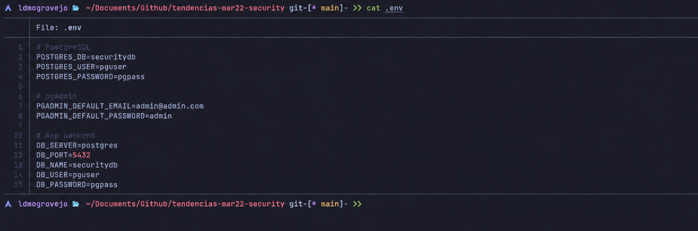
_Figura 8-1. Archivo .env con las variables de entorno para PostgreSQL, pgAdmin y la aplicación backend._

### Paso 3: Crear el Dockerfile multi-stage
Se estructuró el archivo `Dockerfile` en la raíz del proyecto empleando una estrategia de construcción multi-etapa. Esto garantiza una imagen final de producción ligera, segura y optimizada:

```dockerfile
# STAGE 1: Build
FROM eclipse-temurin:21-jdk AS builder

WORKDIR /app

# Copiar archivos de build
COPY mvnw .
COPY .mvn .mvn
COPY pom.xml .

# Descargar dependencias (cacheadas si pom.xml no cambia)
RUN ./mvnw dependency:go-offline -B

# Copiar el código fuente y compilar
COPY src ./src
RUN ./mvnw package -DskipTests

# STAGE 2: Runtime
FROM eclipse-temurin:21-jre

WORKDIR /app

# Copiar solo el JAR desde el stage de build
COPY --from=builder /app/target/*.jar app.jar

EXPOSE 8081

ENTRYPOINT ["java", "-jar", "app.jar"]
```

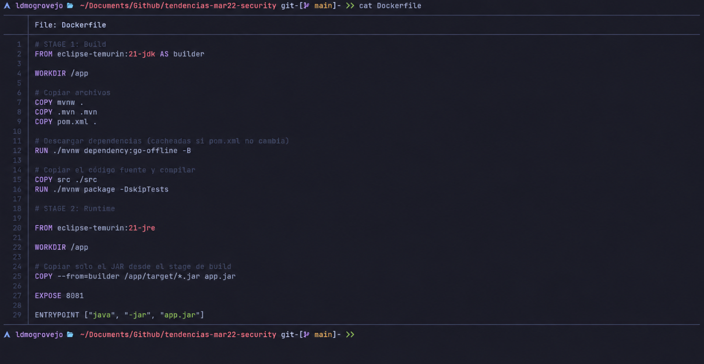
_Figura 8-2. Dockerfile multi-stage mostrando el stage builder con JDK 21 y el stage final con JRE 21._

### Paso 4: Crear el archivo `docker-compose.yml`
Se definió el archivo `docker-compose.yml` en la raíz del proyecto para orquestar de manera unificada los tres componentes del stack tecnológico, asignándoles redes y volúmenes dedicados:

```yaml
networks:
  backend-network:
    driver: bridge

volumes:
  postgres-data:
  pgadmin-data:

services:

  postgres:
    image: postgres:16
    container_name: postgres
    restart: unless-stopped
    networks:
      - backend-network
    environment:
      POSTGRES_DB: ${POSTGRES_DB}
      POSTGRES_USER: ${POSTGRES_USER}
      POSTGRES_PASSWORD: ${POSTGRES_PASSWORD}
    volumes:
      - postgres-data:/var/lib/postgresql/data
    ports:
      - "5432:5432"

  pgadmin:
    image: dpage/pgadmin4
    container_name: pgadmin
    restart: unless-stopped
    networks:
      - backend-network
    environment:
      PGADMIN_DEFAULT_EMAIL: ${PGADMIN_DEFAULT_EMAIL}
      PGADMIN_DEFAULT_PASSWORD: ${PGADMIN_DEFAULT_PASSWORD}
    volumes:
      - pgadmin-data:/var/lib/pgadmin
    ports:
      - "5050:80"
    depends_on:
      - postgres

  app:
    build: .
    container_name: security-app
    restart: unless-stopped
    networks:
      - backend-network
    environment:
      DB_SERVER: ${DB_SERVER}
      DB_PORT: ${DB_PORT}
      DB_NAME: ${DB_NAME}
      DB_USER: ${DB_USER}
      DB_PASSWORD: ${DB_PASSWORD}
    ports:
      - "8081:8081"
    depends_on:
      - postgres
```

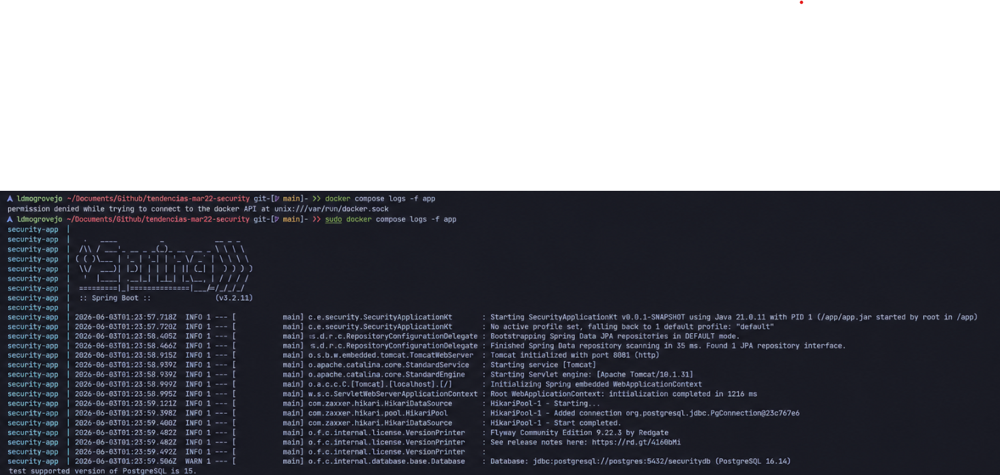
_Figura 8-3. Primera sección del docker-compose.yml con la definición de red, volúmenes y servicios postgres y pgadmin._

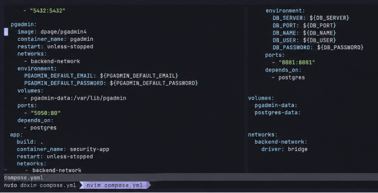
_Figura 8-4. Segunda sección del docker-compose.yml con el servicio app y sus variables de entorno inyectadas desde el archivo .env._

### Paso 5: Construir y levantar el stack completo
Se ejecutó el comando de levantamiento y construcción del entorno para descargar las imágenes correspondientes, ejecutar el build del Dockerfile y arrancar todos los servicios en segundo plano:

```bash
docker compose up --build -d
```

Durante el proceso, Docker Compose procesó la descarga de imágenes base oficiales e inició el build del contenedor de la aplicación. En la fase de compilación, Maven Wrapper descargó las dependencias necesarias y empaquetó el backend en un archivo ejecutable JAR. La imagen ligera resultante fue creada y finalmente los tres servicios cambiaron a estado "Started".

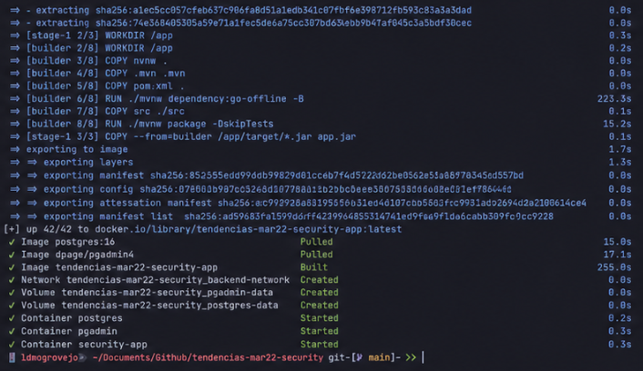
_Figura 8-5. Resultado de docker compose up --build -d (Paso de construcción e inicio de servicios base)._

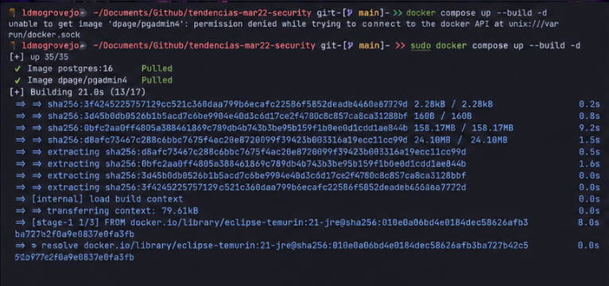
_Figura 8-5 (Continuación). Finalización exitosa del levantamiento del stack en el entorno de Docker._

### Paso 6: Verificar el estado de los contenedores
Se auditó el estado y la disponibilidad de los contenedores para validar que se encuentren activos y respondiendo en sus respectivos puertos asignados:

```bash
docker compose ps
```

Los tres servicios se encuentran operativos bajo el estado `Up`, asociando correctamente los puertos mapeados hacia el host local.

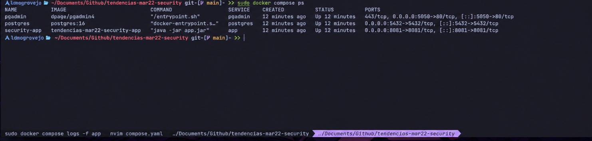
_Figura 8-6. Estado de los contenedores con docker compose ps, confirmando que postgres, pgadmin y security-app están en ejecución._

### Paso 7: Verificar los logs de la aplicación
Se inspeccionó la salida de consola en tiempo real del contenedor de la aplicación Spring Boot para asegurar su correcta inicialización y validar el flujo automático de migración de base de datos implementado con Flyway:

```bash
docker compose logs -f app
```

Los registros reflejaron una secuencia de inicio exitosa: establecimiento de conexión con la base de datos PostgreSQL mediante HikariCP, detección e inicio del proceso de migración de Flyway ejecutando el script `V1__init.sql` (el cual crea la estructura básica e inserta 10 registros de prueba), inicialización de las entidades JPA y arranque del servidor embebido Tomcat en el puerto `8081`.

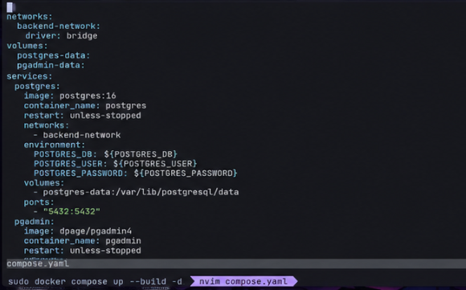
_Figura 8-7. Logs del contenedor security-app mostrando el arranque exitoso de Spring Boot, la conexión a PostgreSQL y la aplicación de la migración V1__init.sql._

### Paso 8: Verificar la imagen generada con multi-stage
Se listaron las imágenes locales de Docker para corroborar la efectividad y el ahorro de almacenamiento provisto por la construcción multi-etapa:

```bash
docker image ls
```

El listado demuestra que la imagen de la aplicación backend optimizada ocupa 553 MB, lo cual representa un ahorro significativo en comparación con los más de 800 MB que hubiese requerido una imagen convencional con las herramientas completas de compilación JDK y dependencias Maven dentro de ella.

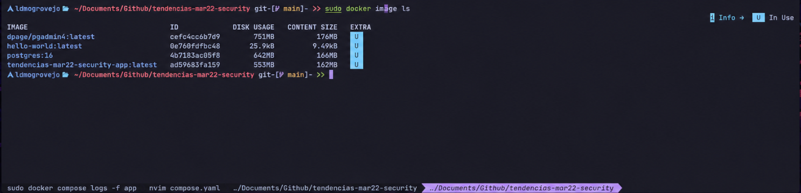
_Figura 8-8. Listado de imágenes con docker image ls, mostrando la imagen de la aplicación backend resultante del Dockerfile multi-stage._

### Paso 9: Verificar pgAdmin y las tablas en la base de datos
Se accedió a la consola de administración web de pgAdmin ingresando a `http://localhost:5050` con las credenciales establecidas en las variables del entorno (`admin@admin.com` / `admin`). Posterior a ello, se registró una nueva conexión de servidor apuntando a PostgreSQL con los siguientes parámetros de acceso:

* **Host:** `postgres`
* **Port:** `5432`
* **Maintenance database:** `securitydb`
* **Username:** `pguser`
* **Password:** `pgpass`

Al conectarse, se desplegó el árbol de objetos navegando por `Databases` -> `securitydb` -> `Schemas` -> `public` -> `Tables`, validándose la creación correcta de la tabla de migración `flyway_schema_history` junto a la tabla de negocio `users`.

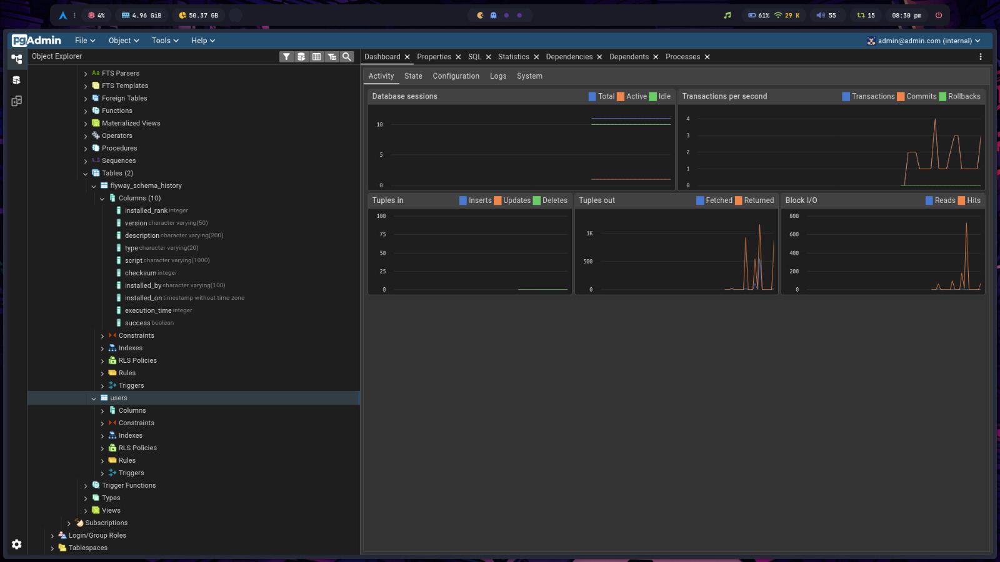
_Figura 8-9. Panel de pgAdmin mostrando la base de datos securitydb con las tablas flyway_schema_history y users creadas por la migración de Flyway._

### Paso 10: Verificar el endpoint de la aplicación desde el navegador
Para corroborar la comunicación interna de extremo a extremo, se consumió el endpoint expuesto por la API REST ingresando a la dirección URL desde el navegador:

[http://localhost:8081/users](http://localhost:8081/users)

La API devolvió exitosamente una respuesta JSON con una colección de 10 elementos que representan a los usuarios precargados en el script de migración SQL.

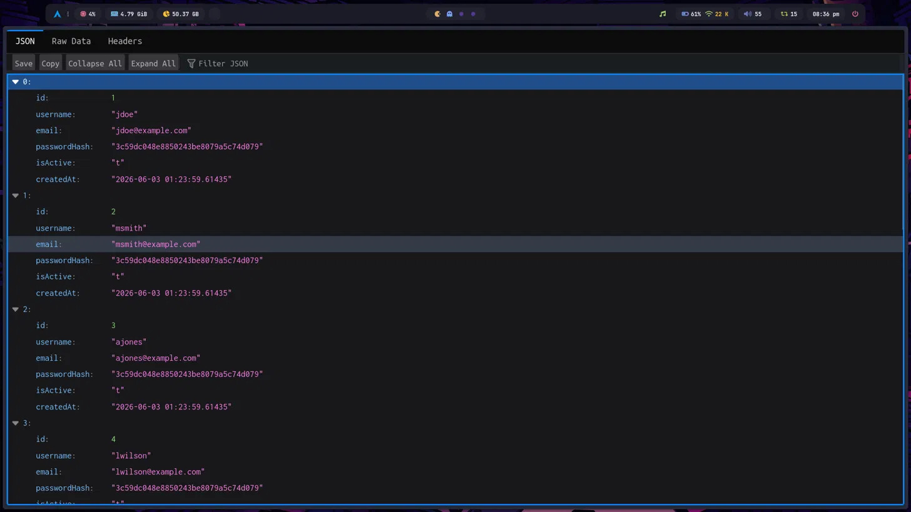
_Figura 8-10. Respuesta del endpoint GET http://localhost:8081/users mostrando el listado de usuarios recuperados desde PostgreSQL a través de la aplicación Spring Boot._

### Paso 11: Detener los contenedores
Para finalizar la práctica y liberar recursos del sistema sin perder la información guardada en los volúmenes, se destruyó el stack de servicios con el comando:

```bash
docker compose down
```

---

## 9. Resultados esperados
Al culminar los pasos de la práctica de laboratorio se alcanzaron satisfactoriamente los siguientes resultados:
1. **Análisis estructural exitoso:** Se comprendió la arquitectura del backend en Kotlin y Spring Boot, reconociendo la lógica de su API y los mecanismos de migración de base de datos.
2. **Externalización y seguridad de parámetros:** Se implementó una configuración desacoplada mediante un archivo `.env`, logrando inyectar de manera segura credenciales y direcciones a través de variables de entorno.
3. **Construcción y empaquetamiento optimizado:** Se logró reducir significativamente el peso de la imagen Docker de la aplicación backend (~553 MB) mediante el uso de Dockerfile multi-stage con imágenes base ligeras de eclipse-temurin (JDK para compilación y JRE para ejecución).
4. **Despliegue unificado y coordinado:** Se configuró un entorno de orquestación ágil con Docker Compose, definiendo redes internas (`backend-network`) para aislar los servicios y volúmenes dedicados para la persistencia del motor de base de datos y de la interfaz de administración pgAdmin.
5. **Verificación de servicios en ejecución:** Se validó que el ecosistema se levanta y se comunica de manera integral. Flyway ejecutó las sentencias de migración al iniciar la aplicación, pgAdmin permitió visualizar de manera gráfica las tablas en la base de datos `securitydb`, y el endpoint de la API (`GET /users`) sirvió la información persistida en formato JSON.

---

## 10. Bibliografía
* Docker Inc. (2025). *Docker overview*. Docker Documentation. [https://docs.docker.com/get-started/overview/](https://docs.docker.com/get-started/overview/)
* Docker Inc. (2025). *Multi-stage builds*. Docker Documentation. [https://docs.docker.com/build/building/multi-stage/](https://docs.docker.com/build/building/multi-stage/)
* Docker Inc. (2025). *Docker Compose overview*. Docker Documentation. [https://docs.docker.com/compose/](https://docs.docker.com/compose/)
* Docker Inc. (2025). *Networking in Compose*. Docker Documentation. [https://docs.docker.com/compose/how-tos/networking/](https://docs.docker.com/compose/how-tos/networking/)
* Docker Inc. (2025). *Volumes*. Docker Documentation. [https://docs.docker.com/engine/storage/volumes/](https://docs.docker.com/engine/storage/volumes/)
* Redgate. (2025). *Flyway documentation*. [https://documentation.red-gate.com/flyway](https://documentation.red-gate.com/flyway)
* Eclipse Foundation. (2025). *Eclipse Temurin Docker images*. [https://hub.docker.com/_/eclipse-temurin](https://hub.docker.com/_/eclipse-temurin)
* PostgreSQL Global Development Group. (2025). *PostgreSQL documentation*. [https://www.postgresql.org/docs/](https://www.postgresql.org/docs/)
* pgAdmin Development Team. (2025). *pgAdmin 4 documentation*. [https://www.pgadmin.org/docs/](https://www.pgadmin.org/docs/)
* Pivotal Software. (2025). *Spring Boot reference documentation*. [https://docs.spring.io/spring-boot/docs/current/reference/html/](https://docs.spring.io/spring-boot/docs/current/reference/html/)
* Guía de la asignatura – Semana 8.
